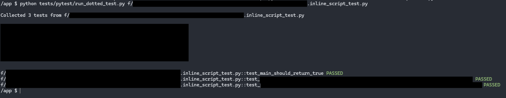

# Testing Python Modules Containing Dot In Filepaths

`pytest` stands as the de facto standard for automated testing in Python. Its simplicity, its fixture system, and extensive plugins make it the go-to solution for maintainable test suites. Naturally, we chose `pytest` to write tests for one of our new projects. However, we encountered some challenges related to the use of dots in filepaths.

## The Challenge with Dot-Containing Filepaths

Our project leverages [Windmill](https://windmill.dev), a modern task orchestrator recommended by our friends at [Qovery](https://www.qovery.com/). However, Windmill exports scripts using filepaths that contain dots, such as `import.flow/import_data.inline_script.py`.

When we attempted to test this module with the following import:

```py
from import_data.inline_script import import_users
```

It resulted in the error below:

```
___ ERROR collecting f/import_flow.flow/import_data.inline_script_test.py ___
ImportError while importing test module '/app/f/import_flow.flow/import_data.inline_script_test.py'.
Hint: make sure your test modules/packages have valid Python names.
Traceback:
/usr/local/lib/python3.13/importlib/__init__.py:88: in import_module
    return _bootstrap._gcd_import(name[level:], package, level)
E   ModuleNotFoundError: No module named 'import_data'
```

The error occurs because the Python interpreter treats dots as delimiters in module names, which are used to separate packages and submodules. In this case, Python misinterprets the intended structure by assuming that `inline_script` is a submodule of the `import_data` package, instead of recognizing `import_data.inline_script` as a single module. Hence the failure.

We confirmed this behavior with the Windmill team. They mentioned that their internal logic uses the `.inline_script` naming convention, and they currently have no option for customization. Although this is most likely a temporary issue, we had to devise a workaround, as only fully-tested code could make it to production.

## Abandoned Solutions

During our exploration, we evaluated three potential approaches. Let's start by reviewing the first two solutions that we ultimately abandoned.

1. Renaming the files by modifying the names directly within `pytest`, via the `configure` hooks.
2. Running a pre-test script to rename the files before launching the `pytest` command.

We won't delve into the implementation details of these two experiments, but we'll explain why we decided to ignore them in favor of the third approach.

If you are only interested by the working solution, you can [jump to the solution](#solution).

### Renaming the Files within Pytest

One approach we considered was renaming the files directly within `pytest`, using the `pytest_configure` and `pytest_unconfigure` functions. They run before and after the test execution, respectively.

```py
from pathlib import Path

# Windmill generates files with names like "foo.inline_script.py", but Python does not accept the extra dot in filenames.
# Therefore, we replace ".inline_script" with "-inline_script" to avoid import issues.

def pytest_configure(config):
    """
    Rename files ending in `.inline_script_test.py` to `-inline_script_test.py` before test collection.
    """
    base_dir = Path(__file__).parent
    renamed_files = []

    for file in base_dir.rglob("*.inline_script_test.py"):
        new_name = file.with_name(file.name.replace(".inline_script_test.py", "-inline_script_test.py"))
        file.rename(new_name)
        renamed_files.append((new_name, file))

    config._renamed_test_files = renamed_files

def pytest_unconfigure(config):
    """
    Restore renamed test files after tests have run.
    """
    renamed_files = getattr(config, "_renamed_test_files", [])
    for new_file, original_file in renamed_files:
        if new_file.exists():
            new_file.rename(original_file)
```

This solution worked well with `pytest`. However, to further enhance our developer experience, we wanted to use a watch mode leveraging `pytest-watch`. Unfortunately, `pytest-watch` does not account for these hooks, making this solution unsuitable for our workflow.

### Using a Pre-Test Script to Rename Files

Another approach we considered was creating a Bash script to rename all the files before launching the Python tests - whether with `pytest` or `pytest-watch`. Since we use a `Makefile` to start our tests, incorporating pre- and post-renaming steps was straightforward. For example, our Makefile includes targets like:

```Makefile
test-pre-renaming-hook:
    ./bin/preTestRenamingHook.sh

test-post-renaming-hook:
    ./bin/postTestRenamingHook.sh

test: test-pre-renaming-hook
    $(DOCKER_COMPOSE_TEST) pytest pytest || $(MAKE) test-post-renaming-hook
    $(MAKE) test-post-renaming-hook

test-watch: test-pre-renaming-hook
    $(DOCKER_COMPOSE_TEST) pytest pytest-watch || $(MAKE) test-post-renaming-hook
    $(MAKE) test-post-renaming-hook
```

This solution introduces a significant drawback: it makes import statements less intuitive for our Engineers. The post-test phase must rename the files back to their original names, which may also contain underscores. Therefore, we can't simply convert every dot into an underscore; we need a dedicated character sequence that can be reliably reverted. We chose to use the `__DOT__` sequence.

The renaming is fully abstracted within the Makefile, making it invisible to the Engineer. As a result, when an Engineer wants to import their module, they would naturally write:

```py
from import_data.inline_script import import_users
```

Which won't work, as the module is now `import_data__DOT__inline_script`. They should instead write:

```py
from import_data__DOT__inline_script import import_users
```

This solution is not intuitive and introduces unnecessary friction for our Engineers, which goes against our Platform team's mission to make development as seamless as possible.

One might argue that we could dynamically modify the test files during runtime to update the import statements. However, this approach would significantly increase complexity and introduce potential race conditions that we are keen to avoid. Ultimately, although the solution might work in theory, its complexity and maintenance cost were too high to justify its implementation.

## Solution: Importing a Python Module by Filepath (Even With Dots) {#solution}

Our end-goal is to enable importing a module by its path, like:

```py
module = import_from_file('f/import_flow.flow/import_data.inline_script.py')

def test_import_data_should_return_true():
    result = module.import_data("file_000.csv")
    assert result is True
```

Let's implement this function.

### Import a Module from its Filepath

For now, let's define this function directly into our test file. We'll extract it at a higher-level later.

```py
def import_from_file(filepath: str):
    module_name = filepath.replace("/", "_").replace(".", "_")
    spec = spec_from_file_location(module_name, filepath)
    module = module_from_spec(spec)
    spec.loader.exec_module(module)

    return module
```

We first define a module name for the file we are going to import. It should be unique, and hence, we rely on the filename, replacing all special characters by an `_`. This way, the compiler won't be confused anymore, as neither slashes nor dots are in the module name. For instance, `f/import_flow.flow/import_data.inline_script.py` would be attached to the module `f_import_flow_flow_import_data_inline_script_py`.

We then need to load the module code into the `module` variable. This is done through a three-step process:

1. Generate the module specs (name, source file, cache information, etc.), via the `spec_from_file_location`,
2. Create an empty shell for the module based on its spec thanks to the `module_from_spec` function,
3. Actually run the module code and populate the empty shell, via the `spec.loader.exec_module` function.

Loading a module is not the most straightforward task, but these three lines provides a ready-to-use `module` object that we can use into our tests.

### Disabling Pytest Auto-Collection

However, running `pytest` will still return the following error:

```
=== ERRORS ====
___ ERROR collecting f/import_flow.flow/import_data.inline_script_test.py ____
ImportError while importing test module '/app/f/import_flow.flow/import_data.inline_script_test.py'.
Hint: make sure your test modules/packages have valid Python names.
Traceback:
/usr/local/lib/python3.13/importlib/__init__.py:88: in import_module
    return _bootstrap._gcd_import(name[level:], package, level)
E   ModuleNotFoundError: No module named 'fetch_files_and_validate_them'
=== short test summary info ===
ERROR f/import_flow.flow/import_data.inline_script_test.py
!!! Interrupted: 1 error during collection !!!!
====== 1 error in 0.14s =======
```

The penultimate line is the most important one: there is an error during the tests collection phase. During this phase, `pytest` scans the filesystem for test modules and tries to import them using the standard Python naming conventions. Hence, it chokes even before executing our custom import file, as one of our filenames contains a dot.

We didn't find any ways to disable the collection phase. Instead, we are going to replace it with a custom collection, through a `tests/pytest/run_dotted_test.py` script:

```py
import sys
import types
import traceback
from importlib.util import spec_from_file_location, module_from_spec

## Some helpers to have a fancier output
class Colors:
    GREEN = "\033[92m"
    RED = "\033[91m"
    YELLOW = "\033[93m"
    RESET = "\033[0m"

## The function we created in the previous section
def import_from_file(filepath: str):
    module_name = filepath.replace("/", "_").replace(".", "_")
    spec = spec_from_file_location(module_name, filepath)
    module = module_from_spec(spec)
    spec.loader.exec_module(module)

    return module

## Run the tests available in a given file
def run_tests(filepath: str, module: types.ModuleType) -> int:
    failures = 0

    ## Custom collection phase: get all the `test_` functions defined in the module
    test_funcs = [
        (name, getattr(module, name))
        for name in dir(module)
        if name.startswith("test_") and callable(getattr(module, name))
    ]

    if not test_funcs:
        print(f"{filepath} :: no test functions found")
        return 0

    print(f"\nCollected {len(test_funcs)} tests from {filepath}\n")

    ## Run all the test functions and display the test status
    for name, fn in test_funcs:
        label = f"{filepath}::{name}"
        try:
            fn()
            print(f"{label} {Colors.GREEN}PASSED{Colors.RESET}")
        except AssertionError:
            print(f"{label} {Colors.RED}FAILED{Colors.RESET}")
            traceback.print_exc()
            failures += 1
        except Exception:
            print(f"{label} {Colors.RED}ERROR{Colors.RESET}")
            traceback.print_exc()
            failures += 1

    ## If no failure, the test passed. Otherwise, it will fail the process.
    return failures

if __name__ == "__main__":
    if len(sys.argv) != 2:
        print("Usage: python run_dotted_test.py path/to/test_file.py")
        sys.exit(1)

    filepath = sys.argv[1]
    try:
        mod = import_from_file(filepath)
        result = run_tests(filepath, mod)
        sys.exit(result)
    except Exception:
        print(f"{Colors.RED}Unexpected error while loading or running {filepath}{Colors.RESET}")
        traceback.print_exc()
        sys.exit(1)
```

This code is quite verbose, due to the output formatting. But it could be boiled down to two steps:

1. Import the module from the filepath,
2. Collect and run all the functions starting with `test_` in this file.

All the rest of the code is some refined ChatGPT magic to mimic the `pytest` output.

We can now run our test using the command:

```sh
python run_dotted_test.py f/import_flow.flow/import_data.inline_script_test.py
```

Which produce an output similar to:



Note that we re-created the same function `import_from_file` as the one we have defined into our test file. To keep our code DRY, we can use our `run_dotted_tests` module instead:

```py
from run_dotted_test import import_from_file

module = import_from_file('f/import_flow.flow/import_data.inline_script.py')

def test_import_data_should_return_true():
    result = module.import_data("file_000.csv")
    assert result is True
```

### Running All your Project Tests

The previous script runs tests from a single file. To execute tests across all the `*_test.py` files in our project, we can write some shell:

```sh
#!/bin/sh

exit_code=0

for file in $(find f -name '*_test.py'); do
  python tests/pytest/run_dotted_test.py "$file"
  result=$?
  if [ "$result" -ne 0 ]; then
    exit_code=$result
  fi
done

exit $exit_code
```

This script locates all files ending with `_test.py` and runs them using our custom runner (`run_dotted_test.py`). It also captures any non-zero exit codes, ensuring that if any test fails, the overall exit code reflects the error, triggering a failure in our CI system.

We can now run all our tests, even with dot-containing filepaths, by running this script.

### Watch Mode

To improve the developer experience, we need a watch mode. When running in watch mode, we want to run all the tests from the test file currently edited (eg. `foo_test.py`). We also want to run all the tests when editing the code file associated to this test file (eg. `foo.py`).

Due to similar issues than the `pytest` collection phase, we can't use the `pytest-watch` package. Instead, we are going to leverage the `watchexec` package.

```sh
watchexec --exts py \
    --restart \
    --emit-events-to=json-stdio \
    ./watch_dotted_test.sh
```

We are listening to changes from all Python files, and are going to emit the changed file data into JSON format (that we can easily manipulate using `jq`). When a file is changed, we'll call a new `watch_dotted_test.sh` script:

```py
#!/bin/sh

read event_json

# Retrieve the path of the file that trigger this change event
changed_file=$(echo "$event_json" | jq -r '.tags[] | select(.kind == "path") | .absolute')
if [ ! -f "$changed_file" ]; then
  exit 0
fi

# If editing the code file, try to run the associated test file
if echo "$changed_file" | grep -q '_test\.py$'; then
  test_file="$changed_file"
else
  test_file="${changed_file%.py}_test.py"
fi

# Run the test file if it ever exists
if [ -f "$test_file" ]; then
  exec python run_dotted_test.py "$test_file"
fi
```

We now have a functional `watch` mode, speeding up our Engineering work. When a file is changed, we can have an immediate feedback about our changes.

And that's finally the end of this long journey. That's definitely a lot of work for a single extra `.` into our filepaths. Fortunately, this is a one-time setup that we can just forget! 